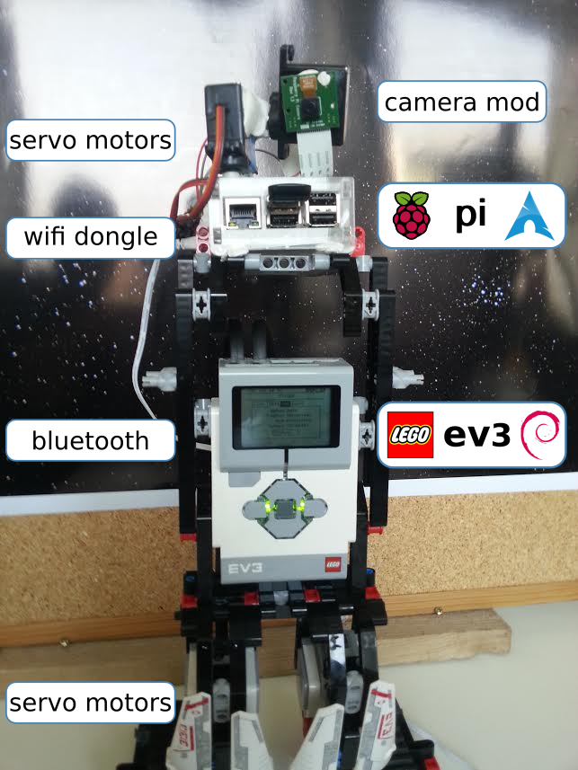

# Eve - a galaxy "macroscope"

Source and documention of the OpenData Hackathon 2015 in Freiburg

 * pi/
    * Source for controlling the Raspberry Pi servo motors
    * Source for accessing picamera and taking a picture
  
 * ev3/
    * Source to move the EV3
  

